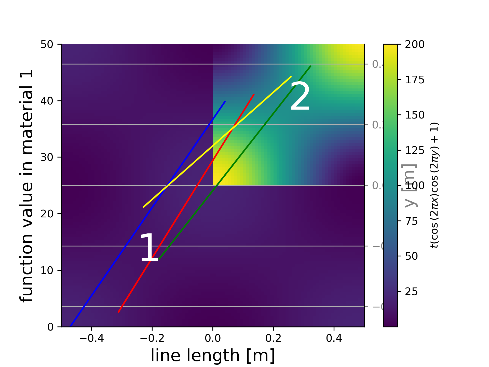
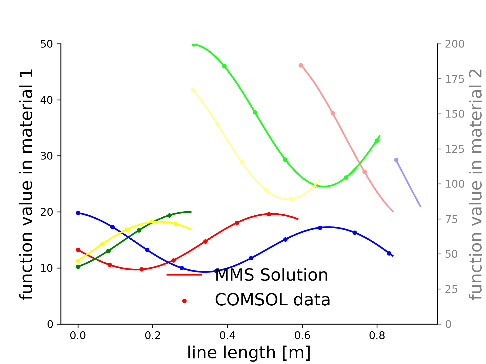

# Method of Manufactured Solutions 
In this folder, the Method of Manufactured Results Plots are shown. Some scripts with Sympy have been employed to evaluate the Source term from analytical functions. The PlotMMS script loads some functions from MMS_package, which plots random lines in the domain in analysis, maps the results from COMSOL (.txt files) with the nearest interpolation method, then evaluates the result on the random line. 

Small inconsistencies can be found in the plot at the interface. This is not due to bad results in COMSOL, but due to the interpolation of the solution using the "nearest" method. They are rarely observablue due to the randommess of the verification lines. 

MMS_M files stand for "Metal" Partition condition, while MMS_MS files stand for "Molten Salts". 
Results for the MMS with FESTIM are available at https://github.com/RemDelaporteMathurin/FESTIM-review/tree/main/verification

