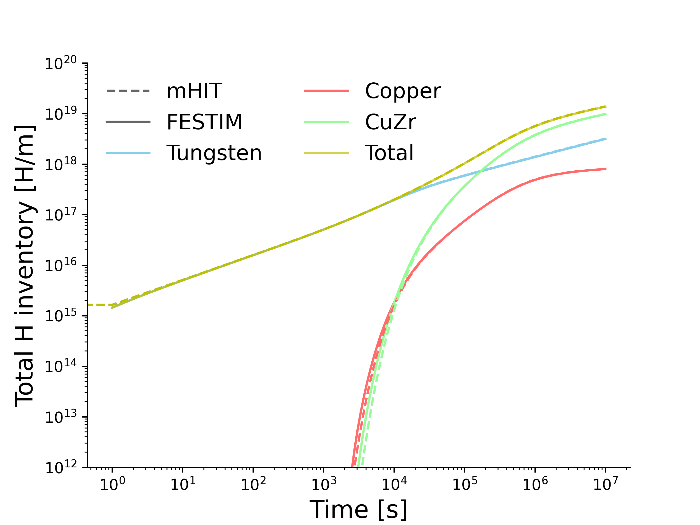

# Graph Scripts and Results

In this folder all the codes used to make paper plots are listed. There may be differences in font sizes due to readability.
The results from MHIMS are loaded and cannot be evaluated from this repo. Comsol Results must be manually extracted from comsol (more info in COMSOL files introductory message). FESTIM results are automatically updated when -py scripts are run in the FESTIM_models folder.  
To plot, run the .ipynb files
Folders include :

### Trapping verifications

Comparison between 3 codes for Purediffusion case, Weak trap, medium trap, Strong trap and Irreversible trap. Example: Medium trap plot.

### Thermal Desorption validations

Eurofer TDS plot

### ITER 2D analysis

Transient comparison between COMSOL and FESTIM on total H inventory for ITER

